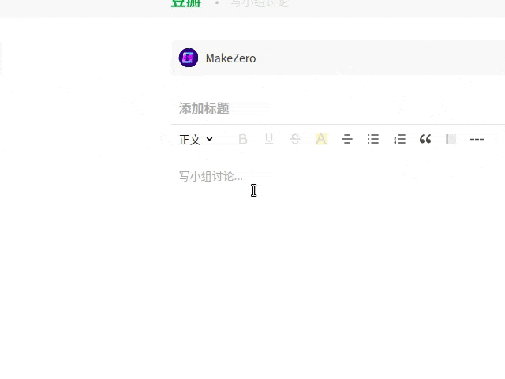

<div align="center">
	
</div>

[](https://travis-ci.com/sheepzh/make-zero.svg?branch=main&status=passed)
[](https://codecov.io/gh/sheepzh/make-zero)
[](https://github.com/sheepzh/make-zero/blob/main/LICENSE)
[](https://github.com/996icu/996.ICU)
[](https://github.com/sheepzh/make-zero/releases) [](https://gitter.im/make-zero-coom/community?utm_source=badge&utm_medium=badge&utm_campaign=pr-badge&utm_content=badge)


> Uncertain Language.

[简体中文](./README.md) | English

## What is it?

<b><i>Make Zero</i></b> is a browser extension/add-on for text encryption. It can run among Chrome, Firefox and the latest Edge.

It can encrypt any texts you typed on net, and only those know your password can decrypt it and see the origin text.

It makes people with the same consensus more easily to discuss in public and to be ~~punkers~~ 🐶🐶🐶. Meanwhile, it also prevents your exhausted thought output from eventually turning into just corpus, even objects which are monitored and detected as to sensitive words.

<u>**Demo video**</u>: [www.youtube.com](https://youtu.be/y97xMhQpce8)

<u>**Downloads**</u>

[](https://chrome.google.com/webstore/detail/%E7%BD%91%E8%B4%B9%E5%BE%88%E8%B4%B5-%E4%B8%8A%E7%BD%91%E6%97%B6%E9%97%B4%E7%BB%9F%E8%AE%A1/ihpcojcdiclghnggnlkcinbmfpomefcc?hl=zh-CN)
[](https://addons.mozilla.org/zh-CN/firefox/addon/make-zero/)
[](https://microsoftedge.microsoft.com/addons/detail/timer-running-browsin/gkjmpdoddilgcfoeokeajfecogaaocol)

## What can it do?

- Text encryption and decryption, supports multiple interactive methods: manual, automatic, and fast cryption.
- Set a custom password, and the default is 123456 after the first installation.
- A variety of ciphertext styles to choose: fixed ciphertext, random ciphertext, Morse code, Cherus.

<div align="center">
  
</div>

## How to build it?

At first, make sure nodejs is installed.

```shell
git clone https://github.com/sheepzh/make-zero.git
cd make-zero
npm install

# Run the development server
# Two output directories:
#  1. "dist_dev" for Chrome & Edge
#  2. "firefox_dev" for FireFox
# You can load it from above folders in development mode of browsers, Chrome, Firefox or Edge.
npm run dev

# Build for production
# The output directory is "chrome_dir"
# Also the package of app and source code to be submitted to the store will be archived and moved to the "market_packages" directory
npm run build
```

## How to use it?

> A tutorial page will be open after installed, just follow it and do once.

- Settings

Click the extension icon of <i>Make Zero</i>, which is always at the top-right corner of browser and the setting page will be popped. You can change password in this page.

- Automatic encryption

  If automatic encryption is checked in the settings panel, the input boxes with ciphertext will display plaintext when focus and ciphertext after focus lost.

- Automatic decryption

  If automatic decryption is checked in the settings panel, the detected ciphertext will be replaced with plaintext with current password, after page loaded completely.

- Manually

  Select texts, right click, and choose the menu item to encrypt or decrypt the selected texts. Also you can press the shortcut key <i>Ctrl</i>+<i>,</i> instead of the above operation.

## Any suggestions?

[ISSUES](https://github.com/sheepzh/make-zero/issues/new)
